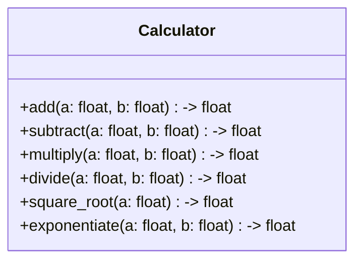
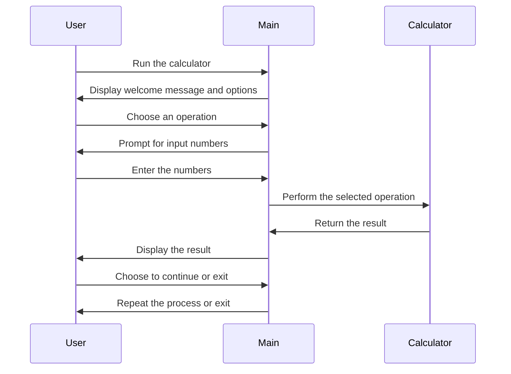

## Implementation approach:
To implement the math operation calculator, we will use the following approach:
1. Create a simple command-line interface for the calculator.
2. Use the built-in Python math library for performing basic arithmetic operations.
3. Implement additional functions for advanced operations such as square root and exponentiation.
4. Use a loop to continuously accept user input and perform calculations until the user chooses to exit.
5. Display the calculation results clearly on the console.

For the user interface, we will use the `click` library, which provides a simple and intuitive command-line interface for Python applications. This will allow us to easily handle user input and display the results.

## Python package name:
```python
"math_calculator"
```

## File list:
```python
[
    "main.py",
    "calculator.py"
]
```

## Data structures and interface definitions:


## Program call flow:


## Anything UNCLEAR:
The requirements are clear and there are no unclear points.